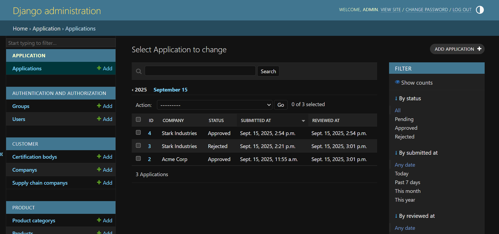
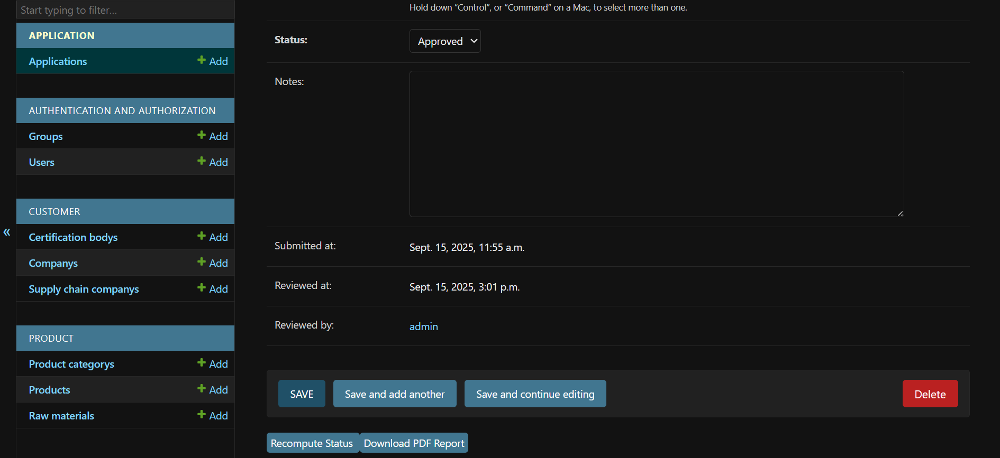
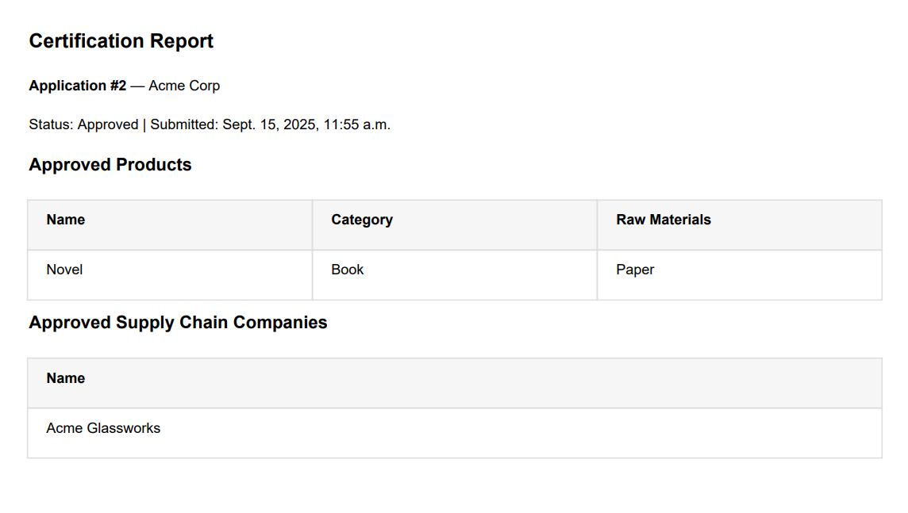

# Django Product Certification Web App


## 📌 Overview

This is a Django-based MVP web app for managing **product certification workflows**.  
It was developed as part of a coding exercise to demonstrate backend design, data modeling, and admin customization skills.

The app allows:

- **Customer Service staff** to input product certification applications from Excel forms.
- **Reviewers** to validate applications, approve or reject products and supply chain companies.
- **PDF reports** to be generated for approved products and companies.

---

## ✨ Features

- **Core Models**: Company, SupplyChainCompany, CertificationBody, ProductCategory, RawMaterial, Product, Application.
- **Django Admin**: Manage all models with filters, search, and inline editing.
- **Seed Data Import**: Import product categories and raw materials from Excel (`product_category.xlsx`, `raw_material.xlsx`).
- **Application Workflow**: Create applications, link companies/products, approve/reject via admin.
- **PDF Export**: Download certification report with approved products and suppliers.
- **Security**: Secret key and debug flag managed via `.env`.
- **Extendable**: Supports optional tasks like background tasks, APIs, and customer-facing pages.

---

## ⚙️ Setup Instructions

### 1. Clone the Repository

```bash
git clone https://github.com/<your-username>/<your-repo>.git
cd <your-repo>/project
```

### 2. Create a Virtual Environment

```bash
python -m venv .venv
.venv\Scripts\activate      # on Windows
source .venv/bin/activate     # on Mac/Linux
```

### 3. Install Dependencies

Dependencies are curated in `requirements.in` and frozen into `requirements.txt` for reproducibility. Install using:

```bash
pip install -r requirements.txt
```

### 4. Configure Environment Variables

Create a `.env` file inside the `project/` folder:

```env
DJANGO_SECRET_KEY=your-secret-key
DEBUG=True
```

### 5. Run Migrations

```bash
python manage.py makemigrations
python manage.py migrate
```

### 6. Create Admin User

```bash
python manage.py createsuperuser
```

> Or use the provided account: **admin / admin**

### 7. Seed Initial Data

```bash
python manage.py import_seed_data
```

This loads product categories and raw materials from `data_files/`.

### 8. Start the Development Server

```bash
python manage.py runserver
```

Visit 👉 http://127.0.0.1:8000/admin/ to log in.

---

## 📂 Project Structure

```
coding_task/
├── data_files/               # Excel seed files
│   ├── application_form.xlsx
│   ├── product_category.xlsx
│   ├── raw_material.xlsx
│   └── process.xlsx
├── project/
│   ├── customer/             # Company, Supply Chain models
│   ├── product/              # Product, Category, RawMaterial models
│   ├── application/          # Application process models
│   ├── core/                 # Shared utilities
│   ├── manage.py
│   └── project/              # Django settings, urls, wsgi
├── .gitignore
├── requirements.txt
├── PROGRESS_REPORT.md        # Development progress tracker
└── TASK_INSTRUCTIONS.md      # Original coding exercise description
```

---

## 🚀 Progress
- ✅ Task 1: Core models, migrations, seed import, admin setup  
- ✅ Task 2: Admin enhancements (inline raw materials, autocomplete)  
- ✅ Task 3: Application workflow with approvals + PDF generation  
- ✅ Task 4 (Optional): Excel upload for applications + bugfix in recompute redirect  


See [PROGRESS_REPORT.md](PROGRESS_REPORT.md) for full details.

---

## 📑 How to Use Excel Upload (Task 4)

1. Go to **Applications → Application uploads** in Django Admin.  
2. Click **Add Application upload**, choose your `.xlsx` file, and save.  
   - File format must include these headers in the first row:  
     ```
     Company | Product | Category | RawMaterial | Supplier
     ```
3. Back in the list view, select the uploaded file(s).  
4. From the **Actions** dropdown, choose **Process selected Excel uploads** → click **Go**.  
5. The system will automatically create or update:  
   - Companies  
   - Product Categories  
   - Raw Materials  
   - Products (linked to categories and raw materials)  
   - Supply Chain Companies  
   - Applications (linked to companies, products, and suppliers)  
6. Go to **Applications → Applications** to review the newly created entries.  
7. Use **Recompute Status** or **Download PDF Report** to finalize the workflow.

---

## 🛠️ Tech Stack
- **Backend**: Django 5.2.4  
- **Database**: SQLite (default)  
- **Excel Parsing**: `openpyxl`  
- **PDF Export**: `xhtml2pdf`  
- **Autocomplete**: `django-autocomplete-light`

---

## 📸 Screenshots

### Admin – Applications List


### Admin – Application Detail with Recompute + PDF Buttons


### Example PDF Report



---

## 👤 Author
Developed by **Irfani Suar** ([GitHub](https://github.com/isuar))

